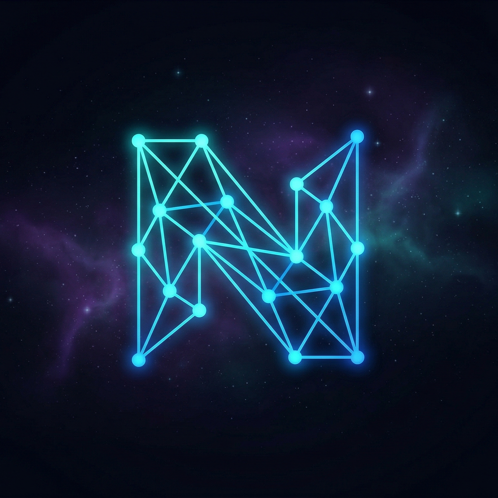

<div align="center">
  
  <h1>Nebula (nep:pl) Meta-Compiler v0.2 Mimarisi</h1>
  <p><i>Dumb Engine, Regex-Based Lexer, Evrensel Ayrıştırıcı ve Satır İçi (Inline) Mantık Enjeksiyonu</i></p>
</div>

---

## 🚀 Nebula Meta-Compiler Nedir?

**Nebula v0.2**, artık statik bir Transpiler olmaktan çıkıp tamamen evrensel ve "Kör" (Dumb Engine) bir mimariye bürünmüştür. Python çekirdeğimiz (motor) hiçbir AST sınıfı, ayrıştırma mantığı veya semantik yasayı kendi içinde hardcode barındırmaz.

**Zero-Overhead ve Sıfır Sınır Felsefesi:** Dillerin zekası (Asenkron State-Machine çevirileri, OOP mimarisi, sınıflar) tamamen dışarıdan yüklenen `.neb` genişletme paketlerindeki (*örn:* `core.neb`, `std_io.neb`)  `<transform>` etiketleri üzerinden beslenir. Standart kütüphaneler de dahil olmak üzere her yeni davranış C# / OOP felsefesine sıkı sıkıya bağlı kalınarak ve motorun içi açılmadan sisteme kazandırılır.

## 🧠 Mimarimizin Devrimsel Özellikleri

### Evrensel Ayrıştırıcı (Agnostic Parser & Node)

Projeye dahil olan dosyalar (`include "..."` ile okunan) önce kapsamlı bir MetaScanner üzerinden geçer ve Grammar kurallarını, yeni Lexer tokenlarını tarar. Parser, tamamen `GenericNode` objesi üreten dinamik bir BNF eşleştiricisine dönüştürülmüştür.

### Template Engine ve Inline Logic Büyüsü (exec() Enjeksiyonu)

Yepyeni `template_engine.py` mimarimiz, yakaladığı o evrensel AST düğümleri için eğer `.neb` dosyası içinde bir XML `<transform node="...">` etiketi görürse, oradaki Python kodunu çeker. Güvenli izolasyonla o kodu anında RAM'de `exec()` ile sarmalayıp, düğüm analizi için yürütür ve geriye kusursuz bir C Kodu tükürür.

## 🔌 Nasıl Çalıştırılır?

Tek bir komutla derleyici kodunuzu okur, `core_packages` çözümlerini tamamlar, C kodunu üretip sıfırdan oluşturduğu `build/` klasörüne kaydeder. Ardından varsa arka planda GCC ile derleyip sonucu saniyesinde ekrana basar:

```bash
python nebula.py tests/hello_world.nep
```

Konsolunuzda o tarihi "Merhaba Dünya!" mesajını ve arka planda inşa edilen o eşsiz nesne yönelimli, sıfır-maliyetli C kalıbını izleyebilirsiniz!
