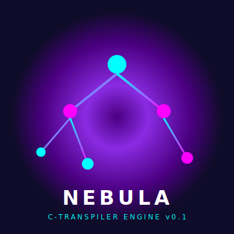

<div align="center">
  
  <h1>Nebula (nep:pl) Çekirdek Motoru v0.1</h1>
  <p><i>Kusursuz C-Transpiler, Zero-Overhead ve Green Thread Entegrasyonu</i></p>
</div>

---

## 🚀 Nebula Motoru Nedir?
**Nebula**, yazılım mimarisinde üst düzey (C# benzeri) bir geliştirici deneyimi sunarken arka planda kendisini saf, katı ve yüksek performanslı **C koduna** dönüştüren (Transpile eden) yepyeni bir programlama dilidir. 

**Zero-Overhead Felsefesi:** Oluşturduğunuz nesneler (class) C tarafında asla Sanal Fonksiyon Tablosu (V-Table) veya ağır OS threadleri yaratmaz. Her şey sisteme mükemmel derecede entegre olan saf `typedef struct` ve C işaretçisi (Pointer) metodolojisine dönüştürülür. İşletim sistemi kaynaklarını mükemmel korur.

## 🧠 Mimarimizin Devrimsel Özellikleri

### LIFO Stack Tabanlı Parser & Kapsam İzolasyonu
Nebula standart bir yukarıdan aşağı okuyucu (parser) kullanmaz. Projeye dahil olan (#include) her dosya kendi **LIFO (Stack) Modülü** içerisine alınır. Böylece bir dosyadaki modifier değişiklikleri (`<modifier>` tagleri üzerinden kurulan kurallar), işlemi bittikten hemen sonra bellekten silinir (`#include-end` bayrağı ile Pop). Yabancı paketler ana projenizi asla zehirlemez (Global Pollution Protection).

### Self-Bootstrapping Sistemi
Nebula sadece bir okuyucu değil, kurallarını dışarıdaki kendi dosyalarından (Örn: `core.neb`) çeken dinamik bir mekanizmadır. Yeni operatörler ve kurallar anında sisteme katılabilir.

## ⚡ State-Machine Asenkron Yapı (Green Threads)
En güçlü yanımız Asenkron yönetimdir! `is_async=True` bayrağına sahip bir asenkron fonksiyon, klasik işletim sistemi işlemciklerine (OS Threads) değil; motorun kendi içinde yönettiği bir **State Machine (Durum Makinesi)** yordamına dönüştürülür. 

* Bir metot içerisinde `await` sinyali verildiğinde, lokal bağlam (local variables) ölmez. Bunlar derleyici tarafından otomatik oluşturulan bir `Context_Struct` belleğine kopyalanır.
* Yapı hemen Nebula Event Loop (Zamanlayıcı) rutinine `yield` edilerek kilitlenmeden asılı kalır. Performans kaybı ve Context Switch maliyeti **Sıfırdır**.

## 🔌 Nasıl Çalıştırılır?

Projeyi denemek ve dinamik Bootstrapped `main.py` giriş noktasını çalıştırmak için aşağıdaki komutu terminalinizde çalıştırın:

```bash
python main.py tests/test_user_code.nep
```

Konsolunuzda LIFO Parser'ın adım adım inşasını, modifier izolasyonu kurallarını ve en sonda `.nep` dosyamızın kusursuz bir `.c` ve `.h` dökümüne nasıl devrildiğini anında görebilirsiniz!
